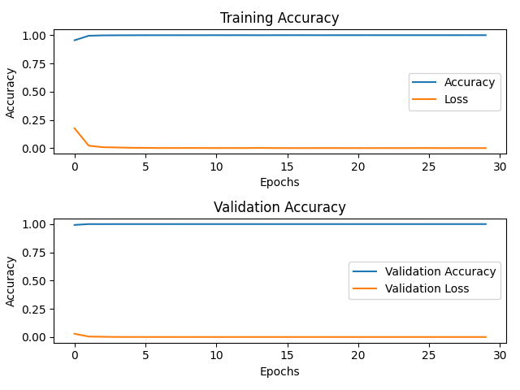
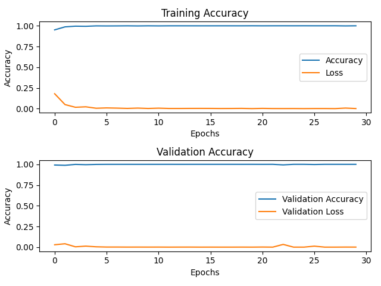

# Chess-Configurations

This is an implemented solution to an image classification task using a dataset (which can be found [here](https://www.kaggle.com/datasets/koryakinp/chess-positions/data)), which consists of artificial images of chessboards and their FEN (Forsyth-Edwards Notation) labels. This was prepared as a final project for the Machine Learning and Intelligent Data Analysis II course in the M.Sc. Cognitive Systems program at the Universität Potsdam.

## Usage
First download the dataset using the link in the introduction. It is intended to be placed in a project folder in a directory labeled "dataset", further divided into the subdirectories "train" and "test". 
Please then prepare the environment by downloading the packages as labeled in `requirements.txt`.

This project is designed to be used with the argparse package from the terminal, being run with a command such as: `> python main.py -x -ht -t -m simple -e`. The following processes are able to be undertaken:

- **Data exploration** (`exploration.py` and `preprocessing.py`):

    - **Sample image**: A sample image from the training dataset is displayed, shown both before and after preprocessing.

    - **Display dataset statistics**

- **Dataset preprocessing** (`preprocessing.py`):

    - **Split dataset**: Separates the training dataset into three parts -- training, validation, and hypertuning.

    - **Image preprocessing**

        - **Data loading**: Loads the images into arrays.

        - **Image transformation**

            - **Downsampling**: Reduces the dimensions of the images to 224 x 224.

            - **Grayscale**: Converts the images from RGB to grayscale.

            - **Normalization**: Normalizes the images.

        - **Separate into blocks**: Divides the chessboard images into separate arrays for each square.

    - **Label preprocessing**: Creates one-hot arrays from the FEN labels.

- **Hyperparameter tuning** (`model.py` and `main.py`): Depending on the model which is chosen, compares the performance in terms of accuracy and loss, varying the learning rate and dropout rates.

- **Model training** (`model.py` and `main.py`): Trains the models on the training data using the optimized hyperparameters.

- **Evaluation**

## Experiments

In the interest of finding the best image classifier architecture, different hyperparameter configurations as well as different model architectures were considered. 

### Hyperparameters

- **Learning rate**: The learning rates used in the Adam optimizer were varied to find the optimal configuation. The following learning rates were considered -- 0.1, 0.01, 0.001, 0.0001.

- **Dropout rate**: The dropout rates used in the simple CNN model were varied to find the optimal configuration. The following dropout rates were considered -- 0.20, 0.35, 0.50, 0.65.

### Model selection

Several models were considered, all of them being mainly focused around the usage of CNNs, though varying slightly in terms of complexity. All models use the Adam optimizer and categorical crossentropy. 

- **Simple CNN**: This model was created with the intentions of establishing a baseline upon which to improve later down along the line. 

    - 2D CNN: ReLU

    - 2D Max Pooling

    - 2D CNN: ReLU

    - Dropout

    - Dense: Softmax

- **LeNet-5**: This is a simple early CNN architecture designed for recognizing handwritten digits.

    - 2D CNN: ReLU

    - 2D Average Pooling

    - 2D CNN: ReLU

    - 2D Average Pooling

    - Dense: ReLU

    - Dense: ReLU

    - Dense: Softmax

- **VGG**: A simplified implementation of the VGG (Visual Geometry Group) model, which is typically used for facial recognition and image classification. 

    - 2D CNN: ReLU

    - 2D CNN: ReLU

    - 2D Max Pooling

    - 2D CNN: ReLU

    - 2D CNN: ReLU

    - 2D Max Pooling

    - Dense: ReLU

    - Dense: Softmax

## Validation Results

Below are graphs showing the training and validation processes for each of the models.

### Simple CNN

### LeNet-5

### VGG

## Results

After the hyperparameters have been tuned and the models have been trained, they are evaluated on the test data. The resulting accuracy and loss values are reported in the table below. There is no significant difference in performance between any of the models, meaning the simple CNN model architecture could be employed to save on tuning and training time.

| Models | Accuracy | Loss |
| -: | :-: | :- |
| Simple | 1.0 | 3.253560407756595e-06 |
| LeNet-5 | 1.0 | 5.233120646153111e-06 |
| VGG | 1.0 | 6.369679113049642e-07 |